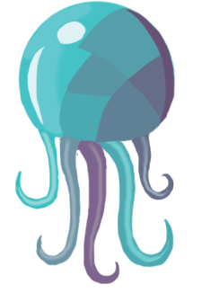

Jellyfish is currently in heavy development
and is not yet useful for much.

# Jellyfish

Multiplayer game development made easy.

<div align="center">
    
</div>

Jellyfish is a game engine designed around multiplayer.
We handle networking, sending packets, and updating state,
so you can focus on what you care about —
designing your game.

## Features

- Write your code once,
run the same bundle on the server and the client,
and we take care of the rest.
State is automatically synchronized between clients.

- Supports WebGL rendering
(thanks to [PIXI.js](https://www.pixijs.com/))
and optionally, physics
(thanks to [matter.js](https://brm.io/matter-js/)).

- Supports JavaScript and [TypeScript](https://www.typescriptlang.org/).

- No IDE. You already like your editor,
and we could never compete with it.
Use what you're comfortable with.

- Easy to learn, but powerful.
Jellyfish isn't magic
— it does things automatically when you want,
but let's you control the details when you need.

## Simple Multiplayer Game

**NOTE:**
This doesn't work yet,
but something like this should work
once it is released.

```js
const { GameObject, keys, isServer, Client, Server, game } = require('jellyfish');

class Player extends GameObject {
    x = 0;
    y = 0;
    sprite = this.graphics.image('/assets/player.png');

    keyHeld(keycode) {
        if (!this.isOwnedByCurrentUser()) { return; }
        switch (keycode) {
            case keys.up: this.y++; break;
            case keys.down: this.y--; break;
            case keys.left: this.x--; break;
            case keys.right: this.x++; break;
        }
    }
}
game.register(Player);

class GameServer extends Server {
    onUserJoined(user) {
        const player = this.createObject(Player);
        player.setOwner(user);
    }
}

if (isServer) { game.createObject(GameServer); }
else { game.createObject(Client);

game.start();
```

## Getting Started

To get started quickly, check out the [quick start guide](./docs/use/articles/quick-start.md).

For more information,
see the rest of [the documentation](./docs/use/use.md).

## Contributing

Ideas? Want to help out? Great!
Make a [new issue](https://github.com/NicholasThrom/jellyfishjs/issues)
or a new [pull request](https://github.com/NicholasThrom/jellyfishjs/pulls).

Check out the [development docs](./docs/development/development.md)
for more information.

## Contact Us

If you have a question,
have general feedback,
want to insult us,
or want to help out,
that that's too bad because we don't have a slack yet.
