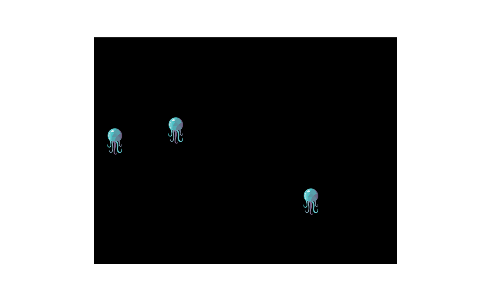

# Making your first game

This guide starts at this
[minimal example](https://github.com/JellyfishJS/template-minimal)
which has everything installed,
and the minimum code needed to run Jellyfish.

It will get you to this
[multiplayer example](https://github.com/JellyfishJS/template-multiplayer),
which is a working multiplayer game
with a circle you can move around.

## Prerequisites

This tutorial assumes you know how to use, and have the following available:
    - Javascript,
    - npm,
    - node,
    - bash, or some similar shell.
If you do not, many fantastic tutorials are available online.

## Installing the minimal example

You can find the minimal example here: [github.com/JellyfishJS/template-minimal](https://github.com/JellyfishJS/template-minimal).

You can download it [here](https://github.com/JellyfishJS/template-multiplayer/archive/refs/heads/main.zip),
or, if you prefer, use GitHub's "Use this template" feature.

Then, unzip the project, and open it in your favourite editor.

## Running the minimal example

In the directory, run the following command
to install Jellyfish and the other dependencies:

```bash
npm install
```

Then, to build and run the game, run

```bash
npm run build && npm start
```

It will print the URL [localhost:3000](http://localhost:3000),
where you should be able to view your game.
For now, it's just a black rectangle.

## What we have so far

`src/index.js` is the file we'll be editing in this tutorial.
Currently it has the following code:

```js
const { game, serve } = require('jellyfish.js');

game.setCanvasByID('game');
game.start();
serve();
```

Here's how it works:

```js
const { game, serve } = require('jellyfish.js');
```
This imports Jellyfish's `game`,
which lets you run a game.
It also imports Jellyfish's `serve`,
which starts up the webpage you can view the game on.

```js
game.setCanvasByID('game');
```

This makes Jellyfish display the game
in the canvas with the ID 'game',
which is what `serve` uses by default.

```js
game.start();
```

This starts the game.

```js
serve();
```

This starts a server where you can see the game on port 3000.
Jellyfish can be used with any type of web server,
but a simple `serve()` is good enough for this tutorial.

This is how it should look:

<div align="center">
    
</div>

## Adding a character

Let's add a character to your screen!

After this step, your `src/index.js` will look like this:

```js
const {
    GameObject,
    ImageSprite,
    Vector,
    game,
    serve
} = require('jellyfish.js');

class Player extends GameObject {
    onCreate() {
        this.position = Vector.xy(100, 300);
        this.sprite = this.createSprite(ImageSprite, '/assets/player.png');
        this.sprite.following = this;
    }
}
game.registerClass(Player);

game.createObject(Player);

game.setCanvasByID("game");
game.start();
serve();
```

Here's what changed:

```js
const {
    GameObject,
    ImageSprite,
    Vector,
    game,
    serve
} = require('jellyfish.js');
```

We have some new imports:
    - `GameObject` is a superclass for pretty much any object in your game.
        You can subclass it to make anything —
        players, bullets, cars, enemies, buttons,
        or whatever else you want.
    - `ImageSprite` is for displaying an image in your game.
    - `Vector` is a 2 dimensional vector —
        if you haven't taken physics,
        this is anything with a direction and a magnitude.
        It's useful for keeping track of location, velocity,
        gravity, forces, and anything like that.

```js
class Player extends GameObject {
```

We also have a Player class, our first GameObject.

```js
    onCreate() {
```

Anything inside the `onCreate` hook is run
when the object is first created.

```js
        this.position = Vector.xy(100, 300);
```

This puts the player 100 pixels from the left,
and 300 pixels from the top of the screen.

```js
        this.sprite = this.createSprite(ImageSprite, '/assets/player.png');
```

This creates a `Sprite` for the player.
Sprite is just a fancy term for something that shows up on the screen.
This `Sprite` is an `ImageSprite`,
which means it shows an image,
and the image can be found at `/assets/player.png`.
If you look in the assets folder,
you'll find the jellyfish logo named `player.png`.

```js
        this.sprite.following = this;
```

This makes the `Sprite` follow the `Player` object.
Sprites can follow any object with a position.

```js
game.registerClass(Player);
```

This registers the `Player` class with Jellyfish.
You need to do this with every class you make,
so that Jellyfish can work with them.

```js
game.createObject(Player);
```

This creates a player.

Now, if you `npm run build && npm start`,
and go to [localhost:3000](http://localhost:3000),
you should see a Jellyfish.

<div align="center">
    
</div>

## Adding controls

Now, we'll add a way to move the player.

After this step, your `src/index.js` will look like this:

```js
const {
    GameObject,
    ImageSprite,
    Vector,
    game,
    serve
} = require('jellyfish.js');

class Player extends GameObject {
    onCreate() {
        this.position = Vector.xy(100, 300);
        this.sprite = this.createSprite(ImageSprite, '/assets/player.png');
        this.sprite.following = this;
    }

    keyHeld(keycode) {
        let movement = Vector.zero;
        switch (keycode) {
            case 40: movement = Vector.up; break;
            case 38: movement = Vector.down; break;
            case 37: movement = Vector.left; break;
            case 39: movement = Vector.right; break;
        }

        this.position = this.position.plus(movement);
    }
}
game.registerClass(Player);

game.createObject(Player);

game.setCanvasByID("game");
game.start();
serve();
```

Here's what changed:

```js
keyHeld(keycode) {
```

This hook is called whenever a key on the keyboard is held.
The keycode is a number that represents the key that is pressed.
You can find tables of keycodes on google,
or, more easily, you can just press keys and see what you get.

```js
        let movement = Vector.zero;
        switch (keycode) {
            case 40: movement = Vector.up; break;
            case 38: movement = Vector.down; break;
            case 37: movement = Vector.left; break;
            case 39: movement = Vector.right; break;
        }
```

Here, we set `movement`
to be a vector in the direction we want to move.
The numbers represent arrow keys —
for example, 40 is the up arrow key.

```js
        this.position = this.position.plus(movement);
```

This updates the position of the game object
while a key is held.

The movement vectors always have a length of 1.
If you want to move twice as fast, you could do this instead:

```js
        this.position = this.position.plus(movement.times(2));
```

Now, if you `npm run build && npm start`,
and go to [localhost:3000](http://localhost:3000),
you should be able to move your Jellyfish.

## Adding multiplayer

Normally, adding multiplayer to a game
involves redesigning it around multiplayer.
With Jellyfish, though, it's an easy change.

At the end of this step, your `src/index.js`
should look like this:

```js
const {
    GameObject,
    ImageSprite,
    Vector,
    Server,
    Client,
    isServer,
    game,
    serve
} = require('jellyfish.js');

class Player extends GameObject {
    onCreate() {
        this.position = Vector.xy(100, 300);
        this.sprite = this.createSprite(ImageSprite, '/assets/player.png');
        this.sprite.following = this;
    }

    keyHeld(keycode) {
        if (!this.isOwnedByCurrentUser()) { return; }

        let movement = Vector.zero;
        switch (keycode) {
            case 40: movement = Vector.up; break;
            case 38: movement = Vector.down; break;
            case 37: movement = Vector.left; break;
            case 39: movement = Vector.right; break;
        }

        this.position = this.position.plus(movement);
    }
}
game.registerClass(Player);

class GameServer extends Server {
    onCreate() { this.start(); }
}
game.registerClass(GameServer);

class GameClient extends Client {
    onCreate() { this.connect(); }
    onRegistered() {
        const player = this.createObject(Player);
        player.setOwner(this.user());
    }
}
game.registerClass(GameClient);

if (isServer) { game.createObject(GameServer); }
else { game.createObject(GameClient); }

game.setCanvasByID("game");
game.start();
serve();
```

Here's what changed:

```js
const {
    GameObject,
    ImageSprite,
    Vector,
    Server,
    Client,
    isServer,
    game,
    serve
} = require('jellyfish.js');
```

We have some new imports.

`Server` is a `GameObject`
that acts as a server for the game.
This is what runs on the backend,
that everyone connects to.

`Client` is a `GameObject`
that acts as a client for the game.
Every user has a `Client` object
in their web browser.

`isServer` is `true` on the server
and `false` on the client.

```js
class GameServer extends Server {
    onCreate() { this.start(); }
}
game.registerClass(GameServer);
```

Here, we make our own server.
When it's created,
the `onCreate` hook starts the server.
Since this is a simple game, we don't need to do anything else here.

```js
        if (!this.isOwnedByCurrentUser()) { return; }
```
Here, if the player isn't owned by the current user,
it's a player controlled by someone else.
Since you cannot move other players,
it returns, instead of moving the Jellyfish.

```js
class GameClient extends Client {
    onCreate() { this.connect(); }
    onRegistered() {
        const player = this.createObject(Player);
        player.setOwner(this.user());
    }
}
game.registerClass(GameClient);
```

Here, we make our own client.
When it's created,
the `onCreate` hook connects to the server.
The `onRegistered` hook is called when the client
has connected to the server,
and the server is ready to interact with the client.
Here, we create a player for the client,
and set its owner to the client's user.
Only the owner of an object can control it directly.

```js
if (isServer) { game.createObject(GameServer); }
else { game.createObject(GameClient); }
```

Finally, instead of creating a player direct,
here, we create a `GameServer` object if we're on a server
and a `GameClient` object if we're on a client.

Now, if you `npm run build && npm start`,
and go to [localhost:3000](http://localhost:3000),
you can play this game in multiplayer.
If you open it in multiple windows,
you'll have multiple jellyfish.
If you rent a server and run it there,
your friends can connect and you can play together!

<div align="center">
    
</div>

## You're done!

That's it! You've made your first multiplayer Jellyfish game!
From here, you can make anything.
